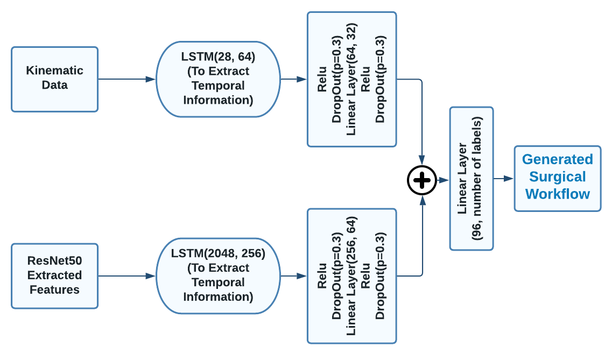
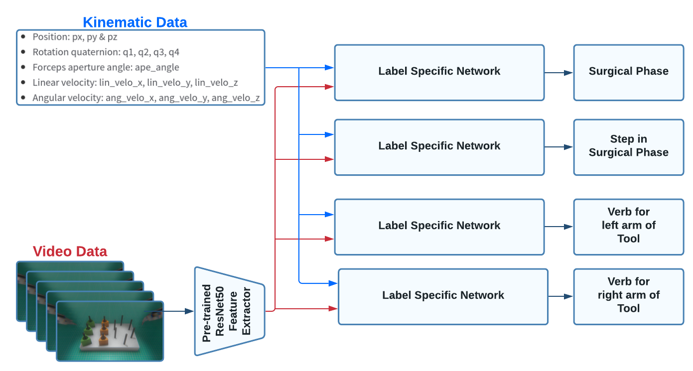

# PETRAW_MICCAI_CHALLENGE

This repository contains the code and models necessary to replicate the results of our proposed approach:

## Proposed Processing Module

<p>

</p>

## Proposed Training Methodology

<p>

</p>

## Getting Started
1. 
    ```
    git clone https://github.com/satyadwyoom/LSTM-based-MTL-model-for-Surgical-Workflow-Recognition.git
    ```

2.  Install dependencies:
    ```
    conda create -n petraw python=3.6
    conda activate petraw
    conda install numpy matplotlib pandas imageio
    conda install pytorch torchvision cudatoolkit=10.2 -c pytorch # for Linux
    ```

3.  Input data format:
    ```
    Video Data:  Videos -> Frames [Joint Pandas Dataframe: Video Frame Location]
    Kinematic Data: [Joint Pandas Dataframe: All Kinematic Data Sequences]
    ```

4.  To Train:
    ```
    python3 petraw_challenge_main.py
    ```

5.  To Generate Workflow Outputs:
    ```
    python3 PETRAW.py
    ```
